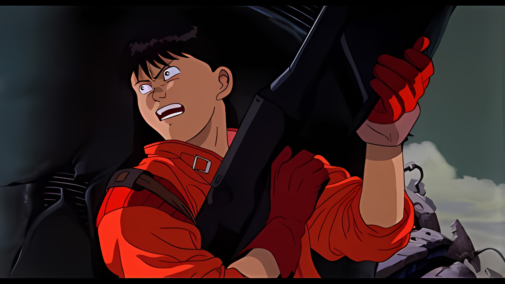

# Anime  Quality Improver

Построено на базе [Real-ESRGAN](https://github.com/xinntao/Real-ESRGAN). Улучшает качество изображения аниме в разы,
пример ниже это преобразование изображения 420x240 в QUHD (2560x1440)

| Оригинал  (420x240)      | Обработанное (2560x1440)          |  
| ------------- |:-------------:|  
|       |  |  

### Что нужно, что бы запустить?

1. Клонировать репозиторий

```bash
 git clone  https://github.com/lambdamai/anime-quality-improver.git
```

2. Поставить виртуальное окружение

```bash
virtualenv venv && source venv/bin/activate
```

Для винды

```bash
python -m virtualenv venv && venv\Scripts\activate
```

3. Поставить зависимости

```bash
pip install -r requirements.txt
```

4. [Скачать](https://github.com/xinntao/Real-ESRGAN/releases/download/v0.2.2.4/RealESRGAN_x4plus_anime_6B.pth) модель и
   положить ее в папку `model`

5. Запустить jupyter

```bash
jupyter notebook
```

#### P.S.

Дополнительно может понадобиться  `ffmpeg`

```bash
sudo apt-get install ffmpeg 
```

И `libx264` для сохранения видео в лучшем качестве 

```bash
sudo apt-get install  libx264-dev
```
